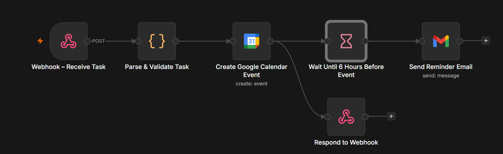

# Task & Meeting Scheduling Automation

An **n8n** workflow that automates task and meeting scheduling by integrating with **Google Calendar** and **Gmail**. The workflow receives requests through a webhook, validates the input, creates a calendar event, schedules a reminder, and sends an email notification before the scheduled deadline.

---

## Workflow Overview

<p align="center">
  
</p>

---

## Features

- Webhook-based REST API
- Task scheduling
- Meeting scheduling
- Input validation
- Google Calendar event creation
- Automatic reminder scheduling
- Gmail email notifications
- Immediate API response
- Asynchronous execution using the n8n Wait node

---

## Technologies

- n8n
- Webhooks
- Google Calendar API
- Gmail API

---

## Workflow Steps

1. Receive a task or meeting request through a webhook.
2. Validate the request payload.
3. Calculate the reminder time.
4. Create a Google Calendar event.
5. Return an immediate success response.
6. Wait until the scheduled reminder time.
7. Send a reminder email to the user.
---

## Workflow Components

| Node | Purpose |
|------|---------|
| Webhook | Receives task or meeting requests |
| Code | Validates input and prepares reminder data |
| Google Calendar | Creates the calendar event |
| Respond to Webhook | Returns the API response immediately |
| Wait | Delays execution until the reminder time |
| Gmail | Sends the reminder email |

---

## Project Structure

```text
automation/
│
├── README.md
├── calendar-reminder-workflow.json
└── workflow-overview.png
```
---

## Import into n8n

1. Open your n8n instance.
2. Click **Import from File**.
3. Select `task-meeting-automation.json`.
4. Configure your Google Calendar and Gmail credentials.
5. Activate the workflow.
6. Send a POST request to the webhook endpoint.

---

## License

This project is provided for educational and portfolio purposes.
